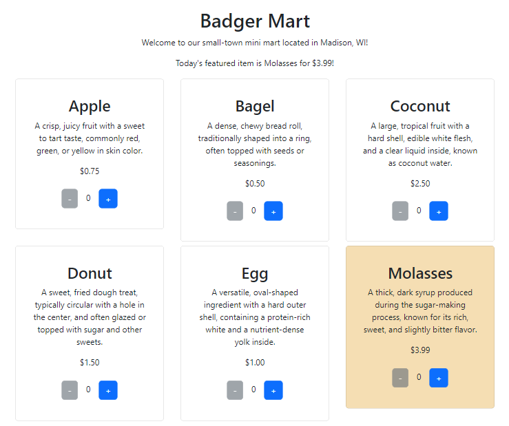
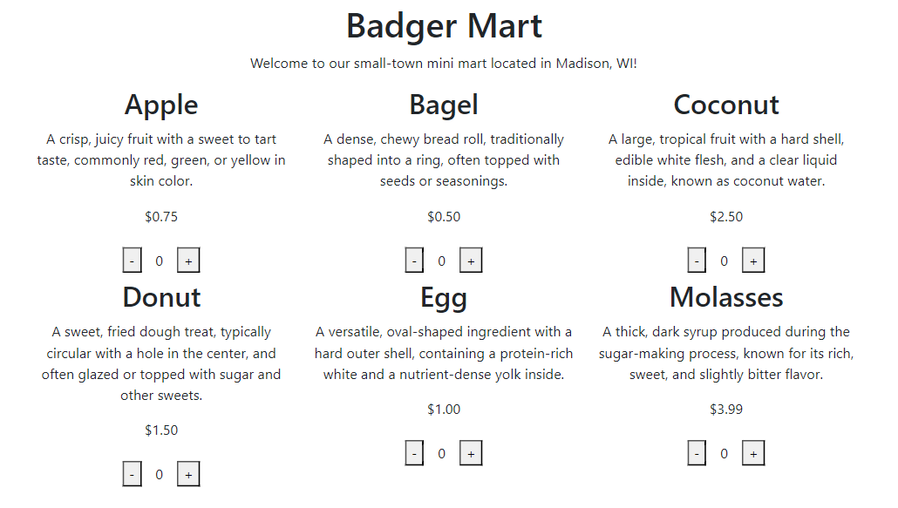
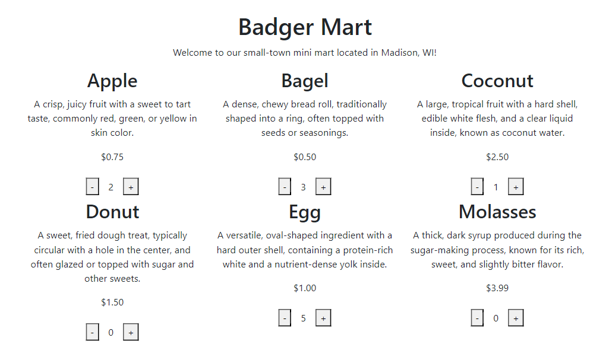
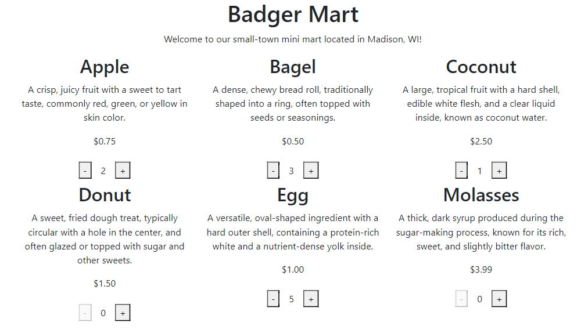
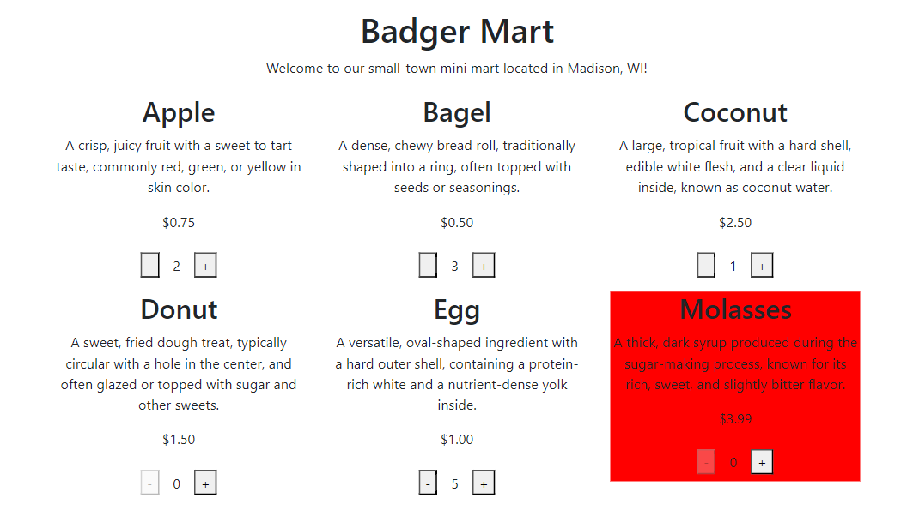
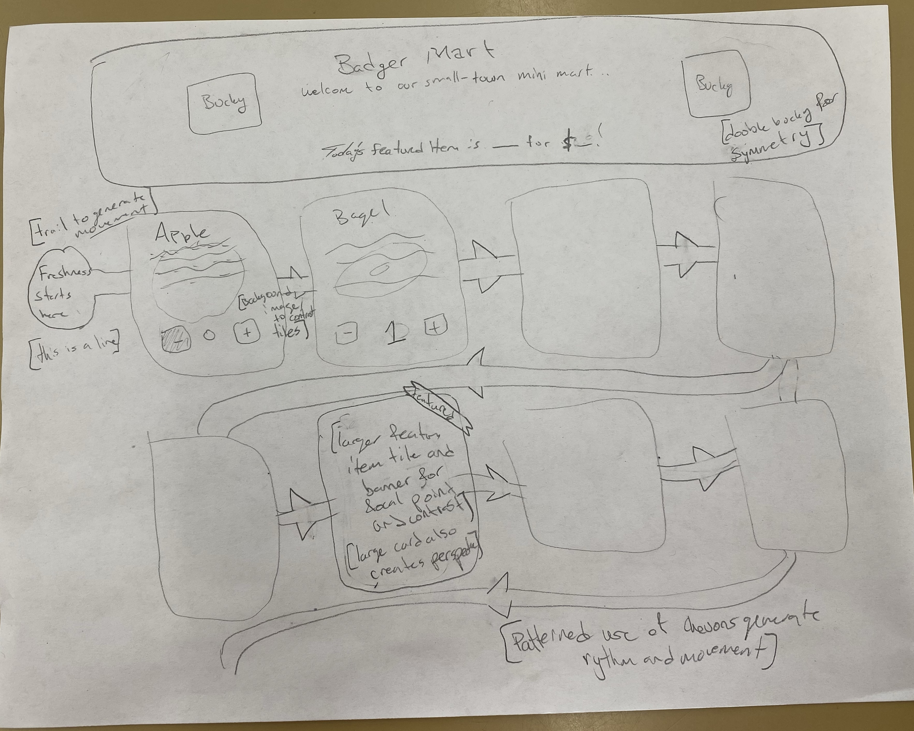

# CS571-S24 HW3: Badger Mart (React!)

Welcome back to Badger Mart! In this homework, you'll create a new version of Badger Mart using an API and React. In addition, you'll be fetching the item data rather than hardcoding it into the HTML. Finally, you will apply your knowledge of visual design to make a more eye-appealing webpage.

**Note:** The steps below show a barebones design. It's up to you (in the *visual design* portion of the assignment) to make a better design. See below for an *example* final solution.



## Setup

The starter code provided to you was generated using [vite](https://vitejs.dev/guide/). Furthermore, [bootstrap](https://www.npmjs.com/package/bootstrap) and [react-bootstrap](https://www.npmjs.com/package/react-bootstrap) have already been installed. **You should *not* re-run the  npm create vite command**. Instead, in this directory, simply run...

```bash
npm install
npm run dev
```

Then, in a browser, open `localhost:5173`. You should *not* open index.html in a browser; React works differently than traditional web programming! When you save your changes, they appear in the browser automatically. I recommend using [Visual Studio Code](https://code.visualstudio.com/) to do your development work.

The two components you will be working with, `BadgerMart.jsx` and `BadgerSaleItem.jsx`, are located in the `components` folder.

## React Fundamentals

### 0. Fetch Sale Items

**This step has already been done for you!**

In `BadgerMart.jsx`, we use the `useEffect` hook to fetch data from the API and save it to a state variable `saleItems`. We then use `map` to display each `BadgerSaleItem`. In addition, we pass all four of the sale item attributes (`name`, `description`, `price`, and `featured`) to `BadgerSaleItem` as props.

In HW4, you will need to do something similar; for now this is given to you!


### 1. Display Sale Item Information

In `BadgerSaleItem.jsx`, in addition to the sale item's name, display its price and description.



### 2. Allow Adding/Removing of Sale Items

In `BadgerSaleItem.jsx`, allow the user to be able to add and remove sale items via the "+" and "-" buttons. Clicking "+" should increase the quantity while clicking "-" should decrease the quantity.

**Hint:** It may be helpful to replace the hardcoded 0 with a state variable which is changed by the `onClick` attribute of the buttons.



### 3. Prevent User Error

In `BadgerSaleItem.jsx`, add a `disabled` prop to the "-" button that disables the "-" button if the quantity is at or below `0`. There is no maximum number of items a user may add to their basket.



### 4. Highlight Featured Item

In `BadgerSaleItem.jsx`, highlight today's featured sale item by making its styling distinct from the other items. For example, you could change the background color, the font boldness, or anything else to distinguish it from the others.

A sale item is considered featured if its `featured` prop is `true`.



### 5. Fetch Featured Item

In `BadgerMart.jsx`, display a line that says...

Today's featured item is ITEM for $PRICE!

...where ITEM and PRICE are replaced with the featured item name and price. You can do this by *either* (1) fetching the featured item from `https://cs571.org/api/s24/hw3/featured-sale-item` or (2) finding the featured item in the `saleItems` array. If you decide to find the featured item in the `saleItems` array, you may *not* assume the last item is the featured item; you must check for the `featured` prop.

You may assume that there is exactly 1 featured item at any given time. When the data is still fetching, simply display the text "Loading..." You will likely only see this loading text for a few milliseconds.


### 6. Implement Visual Design

Using your knowledge of React and visual design, improve your Badger Mart interface based on 3 design elements *or* principles. **This means changing your React code.** Following, please describe these changes by modifying this `README.md` below. **Clearly indicate which 3 design elements or principles you used.**

INSERT YOUR RESPONSE HERE.
#### Elements/Principles I Used: 
1. Unity/Color: I utilized the official Madison red to create brand recognition. Further, I used the same red (and white and black) throughout the page to create a sense of unity.This is also why I used the same black border lines on the header and featured box. I also used a tint of the red hue for text in order to create a sense of unity within the colors there (I tested the accesibility, of course). I also gave the boxes a similar border roundness to the buttons so there wasn't a sharp contrast between box shapes. I also gave the sale items each the same height, and lined up the buttons and prices to give the grid a uniform feel. 
2. Line/Shape: I used lines on the two boxes I wanted to draw the users' attentions to: the header and the feature box. These look nice, introduce Madison colors, and serve to emphasize the boxes they border. I also used shapes around each BadgerSaleItem to create a sense of division on the page and emphasize the difference between different sale items.
3. Movement/Perspective: I aimed to create movement through the page using many different tactics. The most salient thing on the page is the top header in red and black. The title has a fancy font shadow to make it more decorative and emphasize it. Then the next bolde thing is today's feature text. Next I hope the users' attention will be drawn to the feature item box as it stands out with color (text, background, and button), border, and perspective (the box shadow makes it stand out). The item's name is in bold and the quantity selected is also in a hope to generate movement from the title to the button selectors (and reduce empahisis on price). 

### 7. Ideate Visual Design

In the above step, you were likely limited by your knowledge of React. Now, think bigger! Use a hand-drawn or digital sketch to demonstrate an improved interface following 5 design elements or principles. You can re-use elements or principles from above as long as they are applied in a new way. Please **annotate your sketch** to describe the 5 design elements or principles you used.

**Hint:** Images can be included by adding them to the `_figures` folder and using the following markdown format: ``.

INSERT YOUR ANNOTATED SKETCH HERE.


## Done! 🥳

Congrats! Add, commit, and push your files to GitHub Classroom and paste your commit hash in the Canvas assignment.
